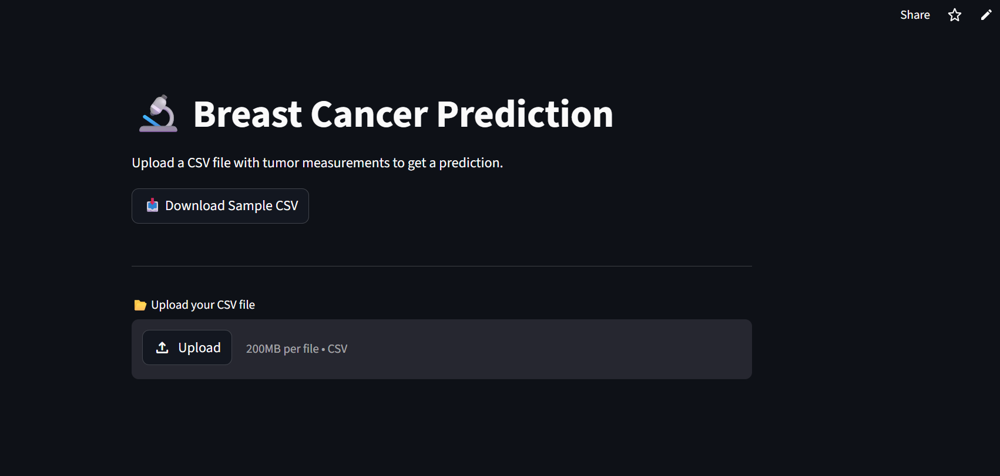
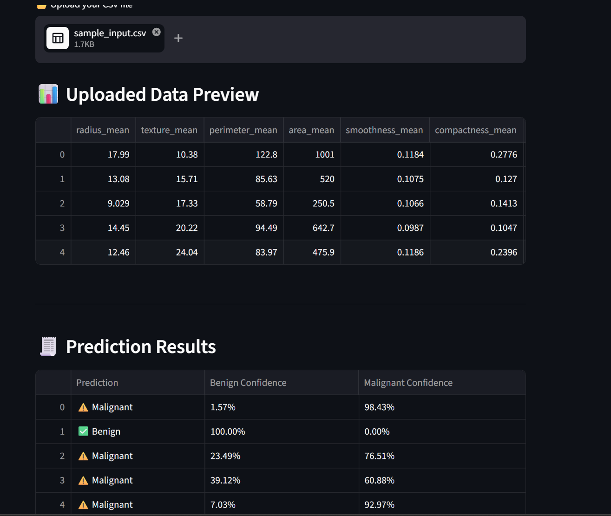
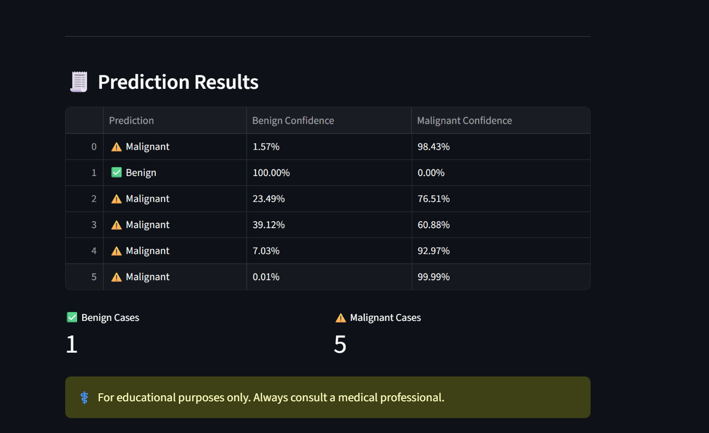

# 🧠 Breast Cancer Prediction using SVM

This project uses a Support Vector Machine (SVM) model to classify breast cancer tumors as **Malignant** or **Benign**.

## 📊 Model Performance
- ✅ Accuracy: **98.25%**
- 🔥 Recall (Malignant): **100%**
- ⚠️ False Negatives: **0 (No missed cancer cases)**

## 🚀 Live Demo

## 📸 Screenshots

  
  
  

## 📌 Key Highlights
- Implemented Support Vector Machine (SVM) for classification
- Applied data preprocessing and feature scaling
- Evaluated model using confusion matrix and classification report
- Focused on minimizing false negatives (critical in healthcare)

## 🛠️ Tech Stack
- Python 🐍
- Scikit-learn
- Pandas & NumPy
- Matplotlib / Seaborn

## 📂 Dataset
Based on the Breast Cancer Wisconsin dataset.

## 🎯 Objective
To build a reliable machine learning model that can assist in early detection of breast cancer.

## ⚠️ Disclaimer
This project is for educational purposes only and should not be used for medical diagnosis.
